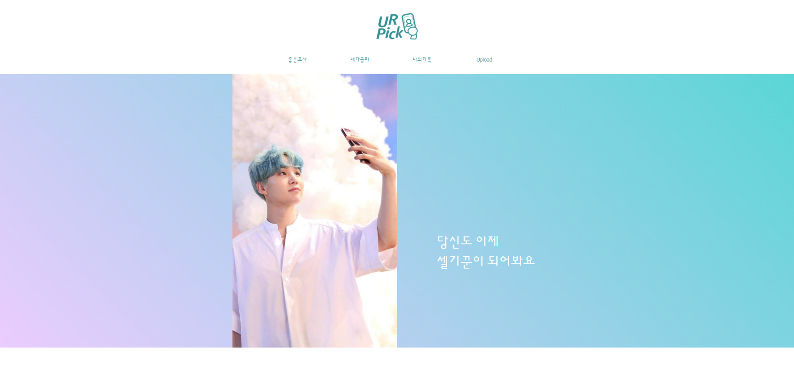
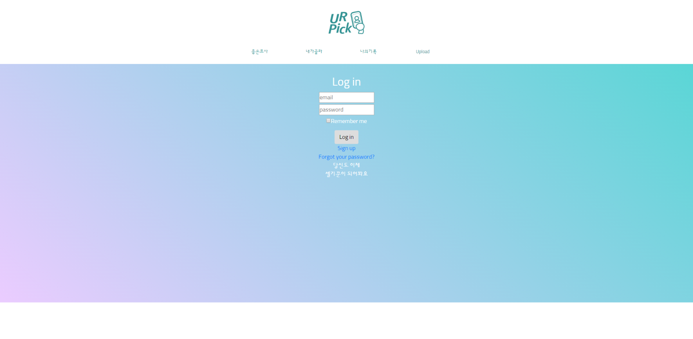
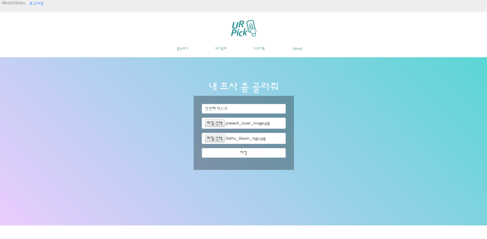
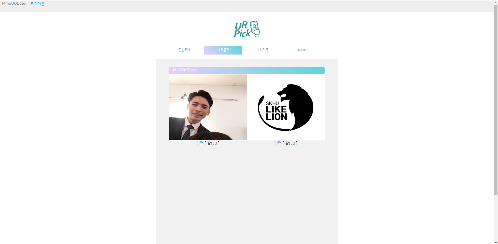
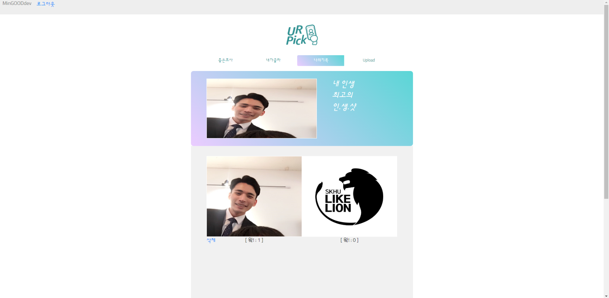
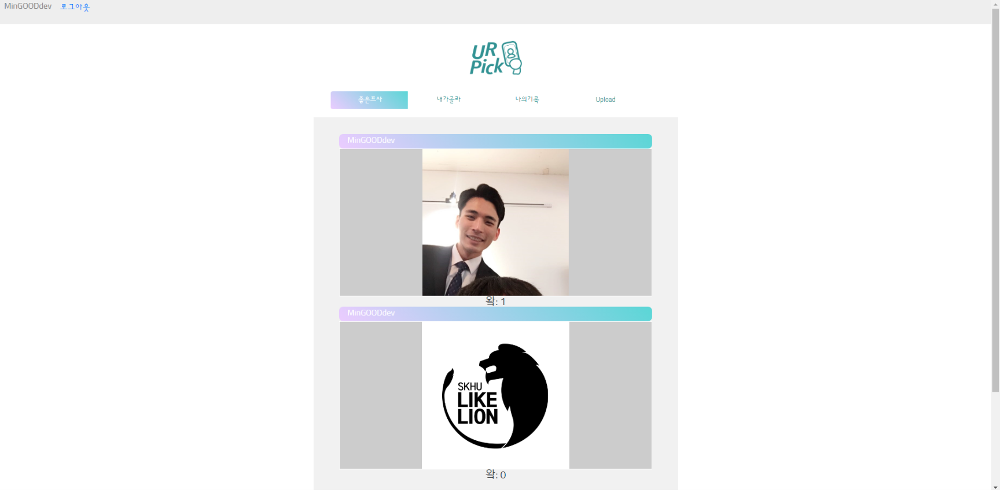
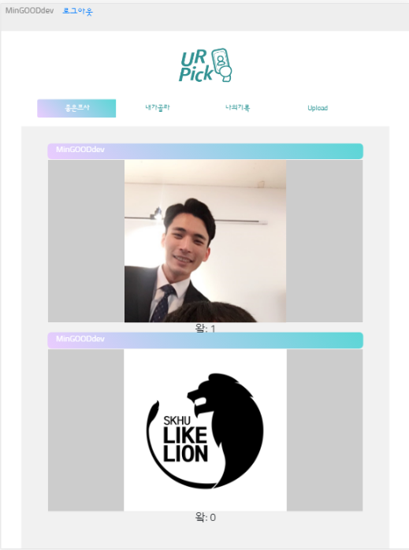
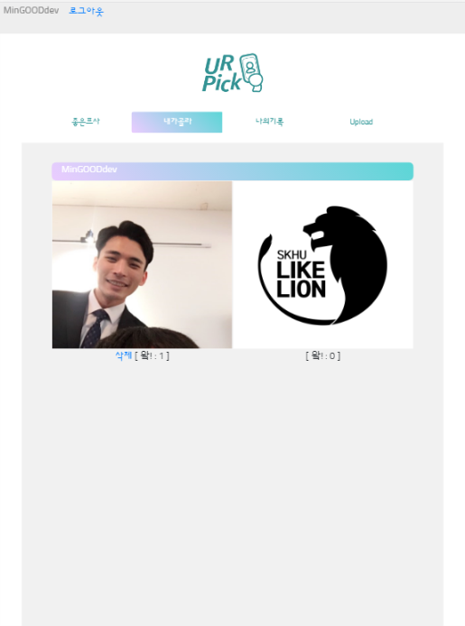
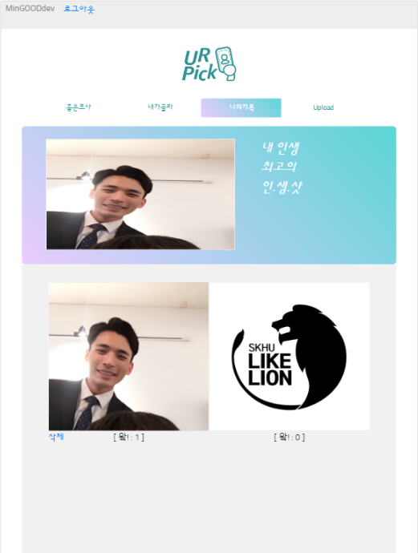
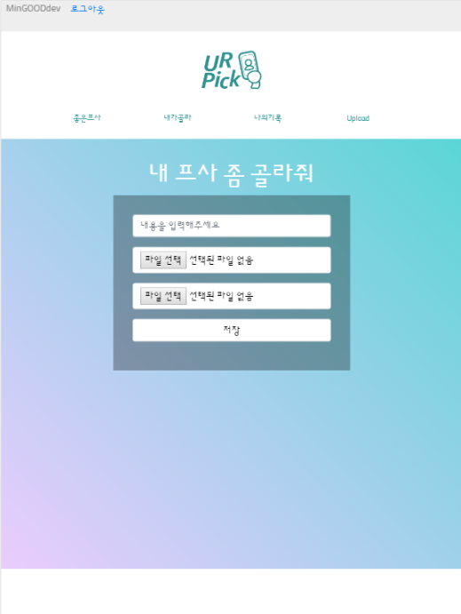

# U R PICK
## 2018 Sinchon Hackathon (6/30 ~ 7/1)
* [ProtoType Document](/docs/URPICK.pdf)

---

## Web Service Explanation

### 1. Main

* 메인 페이지는 누구나 볼 수 있습니다.
* 다른 메뉴를 사용하기 위해서는 회원가입 & 로그인 절차를 거쳐야 합니다.

### 2. Login

### 3. Upload

### 4. Pick (내가골라)

* 2장의 이미지 중 마음에 드는 것을 고르기 전 화면

* 선택을 누르면 카운트가 증가되고 삭제 버튼이 보여지며, 같이 올려진 사진에는 React를 할 수 없습니다.

### 5. MyProfile (나의기록)

* 내가 올린 사진을 확인할 수 있고, 그것들 중 가장 많은 '왘!'을 얻은 사진을 최상단에서 볼 수 있습니다.

### 6. GoodPhoto (좋은프사)

* 모든 사용자가 올린 사진들을 '왘!'을 많이 받은 순서대로 볼 수 있습니다.

---

## Responsive Web
* 반응형으로 만들어 모바일에서도 편하게 접근할 수 있도록 했습니다.

---

## Author
* 김명석 (BE) - [myeongs14](https://github.com/myeongs14)
* 박성은 (FE) - [ssee0328](https://github.com/ssee0328)
* 조민국 (BE) - [MinGOODdev](https://github.com/MinGOODdev) 